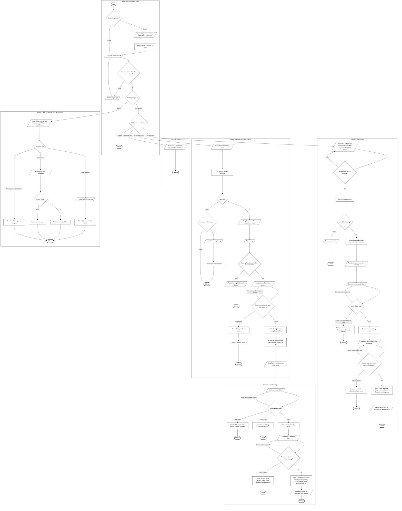

---
config:
  theme: base
  flowchart:
    curve: stepAfter
---

```mermaid
flowchart TD

    %% ==========================
    %% MAIN: AUTENTIKASI DAN MENU
    %% ==========================
    subgraph MAIN["Autentikasi dan Menu Utama"]
        MULAI(["Mulai"]) --> AKUN{"Sudah punya akun?"}
        AKUN -->|"Belum"| REG1[/"Input NIM, nama, jurusan, email, no HP, password"/]
        REG1 --> REG2["Simpan akun, password di-hash"]
        REG2 --> LOG1
        AKUN -->|"Sudah"| LOG1[/"Input NIM dan password"/]
        LOG1 --> LOG2{"Kredensial benar dan akun tidak terkunci?"}
        LOG2 -->|"Tidak"| LOG3[/"Pesan gagal login"/]
        LOG3 --> LOG1
        LOG2 -->|"Ya"| ROLE{"Peran pengguna?"}
        ROLE -->|"Mahasiswa"| MENU{"Pilihan menu mahasiswa"}
        MENU -->|"4 Logout"| LOGOUT(["Selesai"])
    end

    ROLE -->|"Admin"| ADM1
    MENU -->|"1 Titip Barang"| T1
    MENU -->|"2 Cari dan Klaim"| K1
    MENU -->|"3 Riwayat Saya"| R1

    %% ==========================
    %% PROSES 1: TITIP BARANG
    %% ==========================
    subgraph TITIP["Proses 1: Titip Barang"]
        T1[/"Input nama, kategori, ciri-ciri, lokasi temuan, foto wajib, detail verifikasi rahasia"/] --> T2{"Semua data dan foto lengkap?"}
        T2 -->|"Tidak"| T1
        T2 -->|"Ya"| T3["Cek ketersediaan loker"]
        T3 --> T4{"Ada loker Kosong?"}
        T4 -->|"Tidak"| T5[/"Pesan: loker penuh"/]
        T5 --> TZ1(["Selesai"])
        T4 -->|"Ya"| T6["Reservasi loker 10 menit, buat kode titip sekali pakai"]
        T6 --> T7[/"Tampilkan nomor loker dan kode titip"/]
        T7 --> T8[/"Penemu input kode di loker"/]
        T8 --> T9{"Hasil validasi kode?"}
        T9 -->|"Salah, percobaan tersisa"| T8
        T9 -->|"Gagal 3 kali atau reservasi habis"| T10["Batalkan reservasi, loker Kosong, kode hangus, catat log"]
        T10 --> TZ2(["Selesai"])
        T9 -->|"Valid"| T11["Pintu terbuka, catat log buka"]
        T11 --> T12[/"Penemu taruh barang dan tutup pintu"/]
        T12 --> T13{"Pintu tertutup dan sensor mendeteksi barang?"}
        T13 -->|"Belum, waktu masih ada"| T12
        T13 -->|"Lewat 2 menit"| T14["Catat anomali, loker dikunci, notifikasi admin"]
        T14 --> TZ3(["Selesai"])
        T13 -->|"Ya"| T15["Loker Terisi, kode titip hangus, status barang Tersedia, catat log tutup"]
        T15 --> T16[/"Barang tampil di daftar publik tanpa detail rahasia"/]
        T16 --> TZ4(["Selesai"])
    end

    %% ==========================
    %% PROSES 2: CARI DAN KLAIM
    %% ==========================
    subgraph KLAIM["Proses 2: Cari, Klaim, dan Verifikasi"]
        K1[/"Input kategori, kata kunci, lokasi"/] --> K2["Cari barang berstatus Tersedia"]
        K2 --> K3{"Ada hasil?"}
        K3 -->|"Tidak"| K4{"Buat laporan kehilangan?"}
        K4 -->|"Ya"| K5[/"Input data barang hilang"/]
        K5 --> K6["Simpan laporan kehilangan"]
        K6 --> KZ1(["Selesai"])
        K4 -->|"Tidak"| KZ1
        K3 -->|"Ya"| K7[/"Tampilkan daftar: foto, kategori, ciri umum"/]
        K7 --> K8[/"Pilih barang"/]
        K8 --> K9{"Barang Tersedia dan belum ada klaim aktif?"}
        K9 -->|"Tidak"| K10[/"Pesan: barang tidak dapat diklaim"/]
        K10 --> KZ2(["Selesai"])
        K9 -->|"Ya"| K11[/"Input data verifikasi non-publik"/]
        K11 --> K12{"Hasil pencocokan dengan data penemu?"}
        K12 -->|"Tidak cocok, kesempatan tersisa"| K11
        K12 -->|"Gagal 3 kali"| K16["Klaim diblokir, notifikasi admin"]
        K16 --> K17[/"Pesan: hubungi admin"/]
        K17 --> KZ3(["Selesai"])
        K12 -->|"Cocok"| K13["Klaim disetujui, status barang Dalam Klaim"]
        K13 --> K14["Buat kode ambil berbeda dari kode titip, berlaku 24 jam"]
        K14 --> K15[/"Tampilkan nomor loker dan kode ambil"/]
    end

    K15 --> A1

    %% ==========================
    %% PROSES 3: AMBIL BARANG
    %% ==========================
    subgraph AMBIL["Proses 3: Ambil Barang"]
        A1[/"Input kode ambil di loker"/] --> A2{"Hasil validasi kode?"}
        A2 -->|"Salah, kesempatan tersisa"| A1
        A2 -->|"Kedaluwarsa"| A3["Klaim Kedaluwarsa, status barang kembali Tersedia"]
        A3 --> AZ1(["Selesai"])
        A2 -->|"Gagal 3 kali"| A4["Kunci kode, catat log, notifikasi admin"]
        A4 --> AZ2(["Selesai"])
        A2 -->|"Valid"| A5["Pintu terbuka, catat log buka"]
        A5 --> A6[/"Ambil barang dan tutup pintu"/]
        A6 --> A7{"Pintu tertutup dan sensor loker kosong?"}
        A7 -->|"Belum, waktu masih ada"| A6
        A7 -->|"Lewat 2 menit"| A8["Catat anomali, loker dikunci, status Perlu Verifikasi, notifikasi admin"]
        A8 --> AZ3(["Selesai"])
        A7 -->|"Ya"| A9["Kode ambil hangus, status barang Sudah Diambil, klaim Selesai, loker Kosong, catat log"]
        A9 --> A10[/"Notifikasi selesai ke pengambil dan penemu"/]
        A10 --> AZ4(["Selesai"])
    end

    %% ==========================
    %% PROSES: RIWAYAT SAYA
    %% ==========================
    subgraph RIWAYAT["Riwayat Saya"]
        R1[/"Tampilkan riwayat titipan dan klaim beserta status"/] --> RZ(["Selesai"])
    end

    %% ==========================
    %% PROSES 4: ADMIN
    %% ==========================
    subgraph ADMIN["Proses 4: Admin, Anomali, dan Kedaluwarsa"]
        ADM1[/"Buka daftar anomali dan barang tanpa klaim lebih dari 30 hari"/] --> ADM2{"Jenis kasus?"}
        ADM2 -->|"Loker terkunci"| ADM3[/"Periksa fisik loker dan log"/]
        ADM3 --> ADM4["Reset loker atau tandai Rusak"]
        ADM4 --> ADZ(["Selesai"])
        ADM2 -->|"Klaim diblokir"| ADM5[/"Verifikasi manual ke pengklaim"/]
        ADM5 --> ADM6{"Terbukti pemilik?"}
        ADM6 -->|"Ya"| ADM7["Terbitkan kode ambil baru"]
        ADM7 --> ADZ
        ADM6 -->|"Tidak"| ADM8["Tolak klaim dan catat"]
        ADM8 --> ADZ
        ADM2 -->|"Barang tanpa klaim 30 hari"| ADM9["Serahkan ke pengelola kampus"]
        ADM9 --> ADZ
    end

    %% ==========================
    %% STYLING HITAM PUTIH
    %% ==========================
    classDef default fill:#ffffff,stroke:#000000,color:#000000,stroke-width:1px;
    linkStyle default stroke:#000000,stroke-width:1px;

    %% Styling subgraph
    style MAIN fill:#ffffff,stroke:#000000,color:#000000,stroke-width:1px
    style TITIP fill:#ffffff,stroke:#000000,color:#000000,stroke-width:1px
    style KLAIM fill:#ffffff,stroke:#000000,color:#000000,stroke-width:1px
    style AMBIL fill:#ffffff,stroke:#000000,color:#000000,stroke-width:1px
    style RIWAYAT fill:#ffffff,stroke:#000000,color:#000000,stroke-width:1px
    style ADMIN fill:#ffffff,stroke:#000000,color:#000000,stroke-width:1px
```
